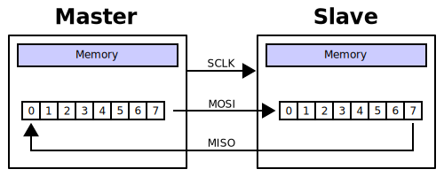
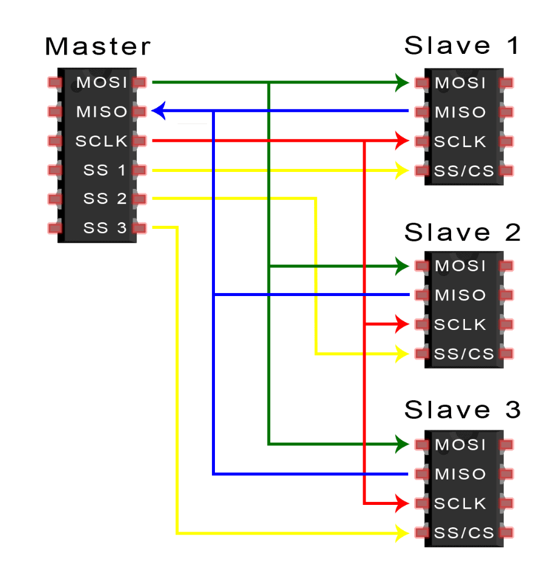
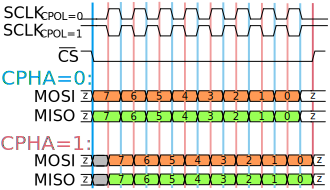

# SPI Protocol 

<p align="center">
  
  
  
  
  
  <a href="LICENSE"></a>
</p>

This repository contains a parameterized SPI master, a parameterized SPI
slave, and self-checking testbenches. Both RTL cores support all four standard
SPI modes and transfer one MSB-first word in full duplex per chip-select
assertion. The implementation intentionally stays small and readable: it is a
learning-oriented RTL core, not a production SoC peripheral.

## SPI at a glance

<p align="center">
  
</p>

<p align="center">
  <sub>
    Diagram by Cburnett,
    <a href="https://commons.wikimedia.org/wiki/File:SPI_8-bit_circular_transfer.svg">Wikimedia Commons</a>,
    licensed under
    <a href="https://creativecommons.org/licenses/by-sa/3.0/">CC BY-SA 3.0</a>.
  </sub>
</p>

SPI is a synchronous, full-duplex serial interface. During every clock period,
the master and slave exchange one bit in opposite directions:

| Signal | Direction | Purpose |
|---|---|---|
| `SCLK` | Master to slave | Serial clock generated by the master |
| `CS_n` | Master to slave | Active-low slave selection and word framing |
| `MOSI` | Master to slave | Master Out, Slave In data |
| `MISO` | Slave to master | Master In, Slave Out data |

The master starts a transfer with a one-cycle `start` pulse, asserts `CS_n`,
and generates `SCLK`. At the same time, MOSI carries `master_tx_data` and MISO
carries `slave_tx_data`. After `DATA_WIDTH` bits, each side exposes the word it
received.

<p align="center">
  
</p>

<p align="center">
  <sub>
    Generic SPI bus topology. The loopback test in this repository connects
    one master to one slave.
  </sub>
</p>

## Features

- Synthesizable Verilog-2001 RTL with no vendor-specific primitives
- Separate [`spi_master`](rtl/spi_master.v) and
  [`spi_slave`](rtl/spi_slave.v) modules
- SPI modes 0, 1, 2, and 3 through `CPOL` and `CPHA` parameters
- Full-duplex, MSB-first, single-word transfers
- Configurable word width through `DATA_WIDTH`
- Configurable master clock divider through `CLK_DIV`
- Active-low asynchronous reset
- Master `busy`/`done` and slave `busy`/`rx_valid` status signals
- Slave `miso_oe` output for external tri-state or shared-bus control
- Self-checking standalone and loopback testbenches
- QuestaSim batch, GUI, and waveform automation

## SPI modes

<p align="center">
  
</p>

<p align="center">
  <sub>
    Diagram by Cburnett, with later contributions by Em3rgent0rdr,
    <a href="https://commons.wikimedia.org/wiki/File:SPI_timing_diagram_CS.svg">Wikimedia Commons</a>,
    licensed under
    <a href="https://creativecommons.org/licenses/by-sa/4.0/">CC BY-SA 4.0</a>.
  </sub>
</p>

`CPOL` sets the idle level of `SCLK`; `CPHA` selects the sampling phase.

| Mode | CPOL | CPHA | SCLK idle | Sample edge | Shift/launch edge |
|---:|---:|---:|---|---|---|
| 0 | 0 | 0 | Low | Rising | Falling |
| 1 | 0 | 1 | Low | Falling | Rising |
| 2 | 1 | 0 | High | Falling | Rising |
| 3 | 1 | 1 | High | Rising | Falling |

For `CPHA=0`, the first transmit bit is valid before the first clock edge. For
`CPHA=1`, the first bit is launched on the leading edge and sampled on the
trailing edge. The master and slave must use the same `CPOL` and `CPHA` values.

## RTL modules

| Module | Role | Parameters | Control and status |
|---|---|---|---|
| [`spi_master`](rtl/spi_master.v) | Generates `SCLK` and `CS_n`; shifts MOSI and samples MISO | `DATA_WIDTH=8`, `CLK_DIV=2`, `CPOL=0`, `CPHA=0` | `start`, `busy`, `done` |
| [`spi_slave`](rtl/spi_slave.v) | Samples MOSI and returns data on MISO | `DATA_WIDTH=8`, `CPOL=0`, `CPHA=0` | `rx_valid`, `busy`, `miso_oe` |

The master SPI clock is derived from the system clock as:

```text
f_sclk = f_clk / (2 * CLK_DIV)
```

`start` is accepted only while the master is idle. The master latches
`tx_data`, transfers one word, writes the received word to `rx_data`, and
pulses `done` for one system-clock cycle. The slave latches its `tx_data` when
`CS_n` falls and asserts `rx_valid` after a complete word is received.

## Verification

The repository uses directed, self-checking testbenches rather than relying on
visual waveform inspection alone.

| Testbench | Scope | Modes | Directed cases | Result |
|---|---|---|---:|---|
| [`tb_spi_master.v`](tb/tb_spi_master.v) | Master with a behavioral slave model | Mode 0 | 4 | Pass |
| [`tb_spi_slave.v`](tb/tb_spi_slave.v) | Slave with a behavioral master model | Mode 0 | 4 | Pass |
| [`tb_spi_loopback.v`](tb/tb_spi_loopback.v) | RTL master connected to RTL slave | Modes 0-3 | 16 total | **16/16 pass** |

The loopback suite checks received data in both directions, status signals,
the one-cycle `done` pulse, and the return of `SCLK`/`CS_n` to their idle
states.

> [View the complete simulation report and waveform analysis](docs/simulation.md)

## Running with QuestaSim

Prerequisites:

- Siemens QuestaSim commands (`vlib`, `vlog`, and `vsim`) available on `PATH`
- GNU Make

Run the complete regression from the repository root:

```sh
make -C sim all
```

Useful targets:

```sh
make -C sim master                    # Standalone master test
make -C sim slave                     # Standalone slave test
make -C sim modes                     # Loopback Modes 0, 1, 2, and 3
make -C sim mode0                     # One selected loopback mode
make -C sim gui TEST=loopback MODE=3  # Open Mode 3 in the GUI
make -C sim clean                     # Remove generated simulation files
```

The GUI target loads [`sim/wave.do`](sim/wave.do) and selects an appropriate
signal group for the chosen testbench.

## Repository layout

```text
.
├── rtl/
│   ├── spi_master.v       # Configurable SPI master RTL
│   └── spi_slave.v        # Configurable SPI slave RTL
├── tb/
│   ├── tb_spi_master.v    # Standalone master testbench
│   ├── tb_spi_slave.v     # Standalone slave testbench
│   └── tb_spi_loopback.v  # Four-mode master/slave loopback testbench
├── sim/
│   ├── Makefile           # QuestaSim batch and GUI targets
│   └── wave.do            # Waveform setup for all testbenches
├── docs/
│   ├── simulation.md      # Timing, results, and waveform analysis
│   └── images/            # Documentation diagrams and captures
├── LICENSE
└── README.md
```

## Design scope

This project deliberately keeps the protocol engine easy to follow:

- One word is transferred per `CS_n` assertion; `CS_n` must return high
  between words.
- There is no FIFO, burst controller, interrupt logic, or AXI/APB/Wishbone
  wrapper.
- The slave operates directly in the incoming `SCLK` domain and assumes clean
  external SPI signals.
- Verification is directed RTL simulation; formal verification, constrained
  random testing, CDC analysis, and post-layout timing are outside the current
  scope.

These boundaries make the repository suitable for studying SPI edge handling,
building a small FPGA experiment, or serving as a clear base for further RTL
work. Production integration would require additional requirements-driven
verification and system-level protection.

## License

The original RTL, testbenches, simulation scripts, and documentation are
released under the [MIT License](LICENSE).

Third-party image assets are not relicensed under MIT and retain their
original licenses. The two diagrams embedded in this README are attributed
above and remain available under their respective CC BY-SA licenses.
