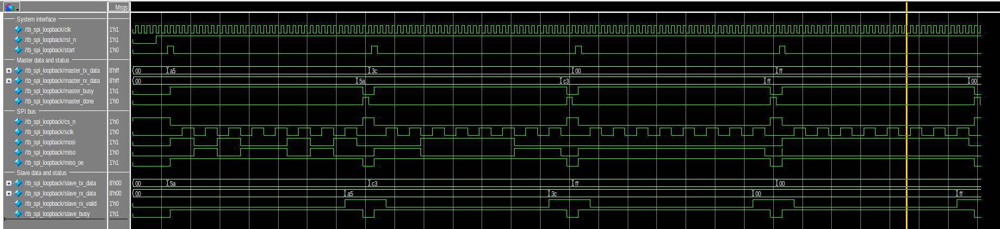
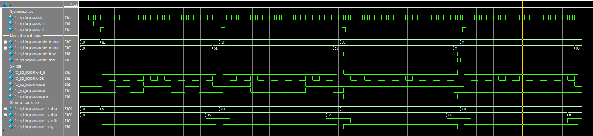
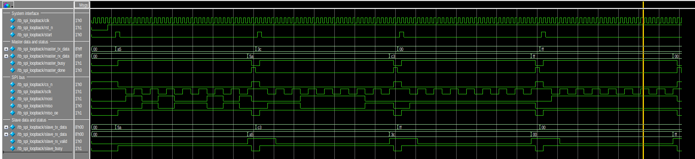

# SPI Timing and Simulation Report

## 1. Overview

This report documents the functional simulation of the SPI master and SPI
slave implemented in [`rtl/spi_master.v`](../rtl/spi_master.v) and
[`rtl/spi_slave.v`](../rtl/spi_slave.v). The parameterized loopback testbench
in [`tb/tb_spi_loopback.v`](../tb/tb_spi_loopback.v) connects both RTL blocks
through `SCLK`, `CS_n`, `MOSI`, and `MISO` and verifies full-duplex transfers in
all four standard SPI modes.

The simulations were run with QuestaSim using the targets provided in
[`sim/Makefile`](../sim/Makefile). Each mode completed four directed test
vectors with no data or status errors.

## 2. Verification configuration

| Item | Configuration |
|---|---|
| Data width | 8 bits |
| Bit order | MSB first |
| System clock period | 10 ns (100 MHz) |
| Clock divider | `CLK_DIV = 2` |
| SPI clock | 25 MHz |
| Chip select | Active low |
| Transfer type | Single-word, full duplex |
| Reset | Asynchronous, active low |

The SPI master generates its clock according to:

```text
f_sclk = f_clk / (2 * CLK_DIV)
       = 100 MHz / (2 * 2)
       = 25 MHz
```

The loopback test applies the following data pairs in every mode:

| Test | Master TX (MOSI) | Slave TX (MISO) | Expected slave RX | Expected master RX |
|---:|---:|---:|---:|---:|
| 1 | `0xA5` | `0x5A` | `0xA5` | `0x5A` |
| 2 | `0x3C` | `0xC3` | `0x3C` | `0xC3` |
| 3 | `0x00` | `0xFF` | `0x00` | `0xFF` |
| 4 | `0xFF` | `0x00` | `0xFF` | `0x00` |

The complementary patterns exercise alternating bits, while the all-zero and
all-one patterns expose stuck-at and final-bit handling errors.

## 3. SPI mode timing

`CPOL` selects the idle level of `SCLK`. `CPHA` selects whether data is sampled
on the leading or trailing edge of each clock period.

| Mode | CPOL | CPHA | SCLK idle | Leading edge | Trailing edge | Sample edge | Shift/launch edge |
|---:|---:|---:|---|---|---|---|---|
| 0 | 0 | 0 | Low | Rising | Falling | Rising | Falling |
| 1 | 0 | 1 | Low | Rising | Falling | Falling | Rising |
| 2 | 1 | 0 | High | Falling | Rising | Falling | Rising |
| 3 | 1 | 1 | High | Falling | Rising | Rising | Falling |

For `CPHA=0`, the first transmit bit must already be valid before the first
leading edge. The slave therefore latches `tx_data` when `CS_n` is asserted and
immediately presents its MSB on `MISO`.

For `CPHA=1`, the first bit is launched on the first leading edge and sampled
on the following trailing edge. The last MOSI bit remains stable through the
final sample edge and is cleared only when the transfer enters its completion
state.

## 4. Expected transfer sequence

Each loopback transaction follows this sequence:

1. The testbench places the master and slave transmit words on their respective
   `tx_data` inputs.
2. `start` is asserted for one system-clock cycle.
3. The master asserts `CS_n` low and raises `master_busy`; the slave responds
   with `slave_busy=1` and `miso_oe=1`.
4. Eight SCLK periods transfer one byte in both directions. MOSI carries the
   master word while MISO carries the slave word.
5. After the final sample edge, `master_rx_data` and `slave_rx_data` contain the
   completed words and `slave_rx_valid` is asserted.
6. SCLK returns to its CPOL idle level, `CS_n` is released, both `busy` signals
   return low, and `miso_oe` is deasserted.
7. `master_done` is asserted for one system-clock cycle.

`slave_rx_valid` remains high after a completed word and is cleared on the
first sample edge of the next transaction. This behavior is intentional and
matches the slave RTL interface contract.

## 5. Waveform analysis

The waveform groups show the system interface, master data/status, SPI bus,
and slave data/status. Each image contains all four directed transfers.

### 5.1 Mode 0 — CPOL=0, CPHA=0



SCLK remains low while the bus is idle. MOSI and MISO are valid before each
rising edge, both receivers sample on rising edges, and transmit data advances
on falling edges. The waveform shows eight SCLK periods while `CS_n` is low for
each word. The slave receives `A5`, `3C`, `00`, and `FF`, while the master
receives `5A`, `C3`, `FF`, and `00`.

The first MISO bit is visible immediately after `CS_n` is asserted, satisfying
the `CPHA=0` setup requirement before the first rising edge.

### 5.2 Mode 1 — CPOL=0, CPHA=1


SCLK also idles low, but data is launched on rising edges and sampled on
falling edges. Unlike Mode 0, the first data bit is launched by the first SCLK
edge. The received words match the transmitted words in both directions.

The waveform also confirms that the final MOSI bit is held through the last
falling sample edge before MOSI returns low during transfer completion.

### 5.3 Mode 2 — CPOL=1, CPHA=0



SCLK remains high while idle. Because `CPHA=0`, the leading falling edges are
the sample edges and the trailing rising edges advance the data. The first bit
is already valid before the first falling edge. All four master and slave
receive words match their expected values.

After each byte, SCLK returns high before `CS_n` is released, demonstrating the
correct CPOL idle behavior.

### 5.4 Mode 3 — CPOL=1, CPHA=1



SCLK idles high. Data is launched on leading falling edges and sampled on
trailing rising edges. The waveform shows the same successful full-duplex data
sequence as the other modes, with the final MOSI bit held through the last
rising sample edge.

At the end of every transaction, SCLK returns high, `CS_n` and `miso_oe` are
released, and `master_done` pulses for one system-clock cycle.

## 6. Status and control checks

The loopback testbench checks data and status at the transaction boundaries,
while the waveforms provide the edge-level timing evidence.

| Verification item | Acceptance criteria | Evidence | Result |
|---|---|---|---|
| Start handshake | `start` is a one-clock pulse | Waveform | Pass |
| Transfer activity | Both `busy` signals are high while `CS_n` is low | Self-check and waveform | Pass |
| Word length | Eight SCLK periods per 8-bit word | Waveform | Pass |
| Clock idle level | SCLK returns to the selected CPOL level | Self-check and waveform | Pass |
| MISO ownership | `miso_oe` is high only while the slave is selected | Self-check and waveform | Pass |
| Receive validity | `slave_rx_valid` is asserted after the completed word | Self-check and waveform | Pass |
| Completion pulse | `master_done` lasts one system-clock cycle | Self-check and waveform | Pass |
| Full-duplex data | Master RX equals slave TX and slave RX equals master TX | Self-check | Pass |

## 7. Simulation results

| SPI mode | CPOL | CPHA | Test vectors | Result |
|---:|---:|---:|---:|---|
| 0 | 0 | 0 | 4 | Pass |
| 1 | 0 | 1 | 4 | Pass |
| 2 | 1 | 0 | 4 | Pass |
| 3 | 1 | 1 | 4 | Pass |
| **Total** |  |  | **16** | **Pass** |

QuestaSim compiled the RTL and testbenches with zero errors and zero warnings.
All 16 full-duplex loopback cases completed successfully.

## 8. Reproducing the simulation

Run the following commands from the repository root:

```sh
# Run the loopback test in all four modes
make -C sim modes

# Run the standalone master/slave tests and all loopback modes
make -C sim all

# Open a selected loopback mode in the QuestaSim GUI
make -C sim gui TEST=loopback MODE=0
make -C sim gui TEST=loopback MODE=1
make -C sim gui TEST=loopback MODE=2
make -C sim gui TEST=loopback MODE=3

# Remove generated simulation files
make -C sim clean
```

## 9. Scope and limitations

- The standalone master and slave testbenches provide independent Mode 0
  checks; Modes 1–3 are covered by the integrated loopback test.
- The test uses directed 8-bit vectors with `CLK_DIV=2`; it is not an exhaustive
  parameter-space or constrained-random verification environment.
- The simulation is functional RTL verification. It does not model board-level
  signal integrity, clock-domain-crossing metastability, or post-layout timing.
- The SPI cores transfer one word per chip-select assertion and do not include
  FIFO or bus-interface logic.

## 10. Conclusion

The simulated waveforms demonstrate correct MSB-first, full-duplex SPI
operation in Modes 0, 1, 2, and 3. Clock polarity, sample phase, chip-select
timing, output enable, receive-valid behavior, and completion signaling match
the intended interface. All 16 loopback transactions pass.
